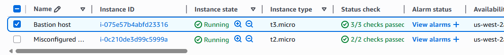
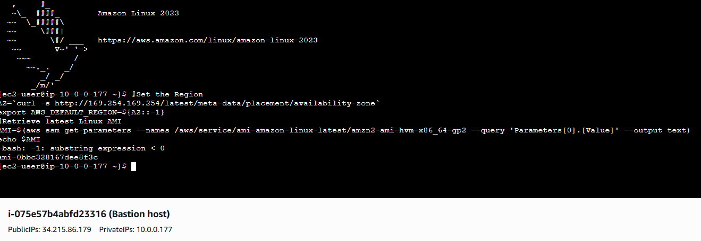
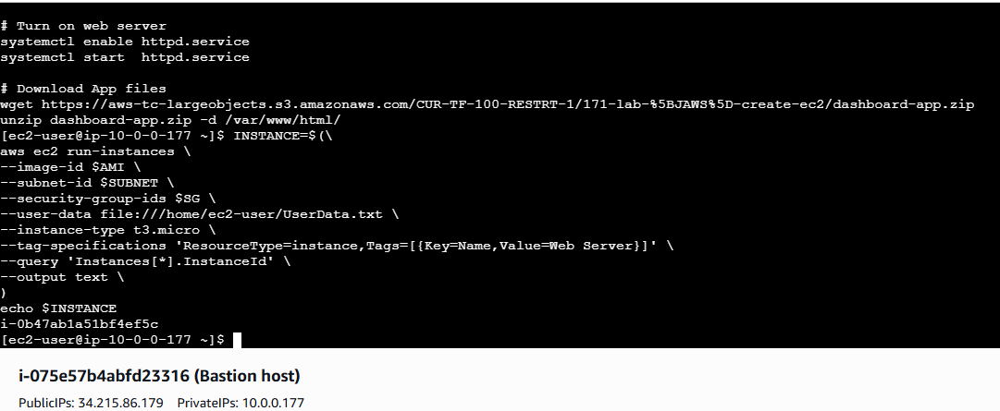

# Compute Lab: Launching an EC2 Instance

## Overview
In this lab, I’ll walk through the process of creating an Amazon EC2 instance from scratch. EC2 (Elastic Compute Cloud) is one of AWS’s core services that lets you launch and manage virtual servers in the cloud.

By the end of this lab, I’ll have a fully running EC2 instance that I can connect to and use as my virtual server.

## Objective
1. Launch an EC2 instance using the AWS Management Console
2. Select an appropriate Amazon Machine Image (AMI)
3. Configure instance type, storage, and networking
4. Secure the instance with key pairs and security groups
5. Test connectivity to the instance

## Prerequisites
1. Before starting, make sure you have:
2. An AWS account with access to the EC2 service
3. Basic knowledge of VPCs, subnets, and security groups
4. An existing key pair or the ability to create one (to SSH/RDP into the instance)

## Steps Taken
1. Launch an Instance – Open the EC2 Dashboard and click Launch Instance.
2. Choose an AMI – Select a base image (e.g., Amazon Linux 2, Ubuntu, Windows).
3. Select Instance Type – For this lab, I’ll use t2.micro (free tier).
4. Configure Networking – Pick a VPC and subnet, leave defaults if unsure.
5. Add Storage – Default EBS volume is fine unless extra space is needed.
6. Set Security Group – Allow required traffic (e.g., SSH 22 for Linux or RDP 3389 for Windows).
7. Assign Key Pair – Use or create a key pair to securely access the instance.
8. Review & Launch – Confirm settings and launch.

## Clean Up
Terminate the instance and remove related resources (security group, key pair, EBS volume) to prevent charges.

## Wrap-Up
With just a few steps, I launched, connected to, and verified an Amazon EC2 instance. This hands-on lab reinforced how to set up compute resources securely and efficiently on AWS.

## Screenshots
**Creating an EC2 Instance**

**EC2 Instance Connect session**

- Retrieves the Availability Zone of the running instance from metadata
- Extracts the Region from the Availability Zone and sets it as an environment variable
- Uses AWS Systems Manager (SSM) with get-parameters to fetch the AMI ID from Parameter Store
- The requested AMI is Amazon Linux 2 (same as used for the bastion host)
- Stores the AMI ID in an environment variable called AMI

**Creating a new EC2 instance using EC2 Instance Connect session**

