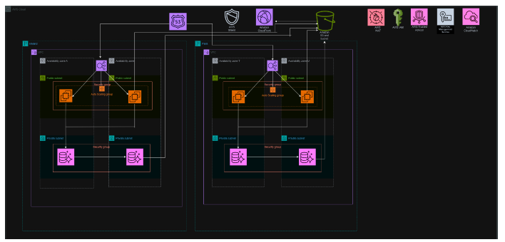

**E-commerce 3D Architecture**

# Multi-Region E-Commerce Infrastructure on AWS

## Introduction
I have designed an AWS infrastructure for a global **e-commerce platform** expected to serve millions of users.  
The solution focuses on **high availability, seamless scalability, fast performance, strong security, and cost efficiency**.  

As the AWS Architect, my responsibility is to:
- Craft an architecture that handles high traffic loads without interruption.  
- Ensure fast page loads and smooth user experiences.  
- Implement strict security measures for encryption, access control, and threat mitigation.  
- Optimise costs by leveraging managed services and efficient resource allocation.  

## Requirements & Solutions

### 1. High Availability
- **Multi-Region Setup**:  
  - Primary Region: **Ireland**  
  - Failover Region: **Paris** (activated only if Ireland fails, to reduce costs).  
- **Auto Scaling Groups**: Scale compute resources automatically based on demand.  
- **Amazon Route 53**: DNS-based load balancing with failover routing to reroute traffic in case of regional failures.  
- **Amazon S3 & Aurora Cross-Region Replication**: Ensures continuous data synchronisation between Ireland and Paris.  
- **Multiple Availability Zones (AZs)**: 2 AZs per region for redundancy and resilience.  

### 2. Scalability
- **Auto Scaling Groups (ASG)**: Adjusts number of EC2 instances dynamically, ensuring optimal capacity.  
- **Amazon Aurora Read Replicas**: Improves read performance and allows failover if the primary database fails.  

### 3. Performance
- **Multi-Region Architecture**: Routes users to the nearest region for faster access.  
- **Amazon CloudFront (CDN)**: Caches and delivers content globally with low latency.  
- **Amazon Route 53**: Directs traffic to the closest region or load balancer for optimal responsiveness.  
- **Elastic Load Balancer (ELB)**: Distributes traffic across multiple EC2 instances to improve performance and fault tolerance.  

### 4. Security
- **AWS Shield Standard**: Protects against DDoS attacks, integrated with CloudFront and Route 53.  
- **AWS WAF (Web Application Firewall)**: Blocks SQL injections, XSS, and other common web exploits.  
- **IAM (Identity and Access Management)**: Provides secure, role-based access control.  
- **AWS KMS (Key Management Service)**: Encrypts data at rest and in transit.  
- **Private Subnets**: Protect sensitive resources like databases from direct internet exposure.  
- **Security Groups**: Control inbound/outbound traffic for EC2 and database instances.  

### 5. Cost Optimization
- **Amazon S3**:  
  - Single bucket for archives and backups.  
  - Cross-Region Replication for redundancy.  
  - Access controlled with IAM roles and bucket policies.  
- **Auto Scaling**: Prevents over-provisioning by scaling resources only when needed.  
- **AWS Trusted Advisor**: Provides real-time cost-saving and performance recommendations.  
- **Right-Sizing Instances**: Regular monitoring to adjust instance types and sizes based on actual usage.  

## Additional Services
- **Amazon CloudWatch**:  
  - Monitors application and infrastructure performance.  
  - Provides logs, metrics, and alerts for proactive troubleshooting.  

## Justification: Why Aurora?
- **Performance**: Handles large-scale workloads with better per-instance throughput.  
- **High Availability**: Built-in automated failover and cross-region replication.  
- **Scalability**: Serverless options and read replicas scale automatically during traffic spikes.  
- **Cost Efficiency**: Higher upfront instance costs but fewer total instances required due to better performance.  

## Alternative Consideration: Amazon RDS
- **Strengths**: Managed service, multi-AZ deployments, read replicas, security features, and support for multiple database engines.  
- **Limitations for Global Scale**:  
  - Requires more/larger instances to handle millions of users.  
  - Manual scaling increases operational complexity and potential downtime.  
  - Costs rise significantly with scaling and high-availability configurations.  
- **Best Fit**: Small to mid-sized organisations with moderate traffic needs.  

## Status
Multi-Region, fault-tolerant architecture drafted.  
Next step: Finalise **infrastructure diagram** and conduct **cost-performance analysis**.  